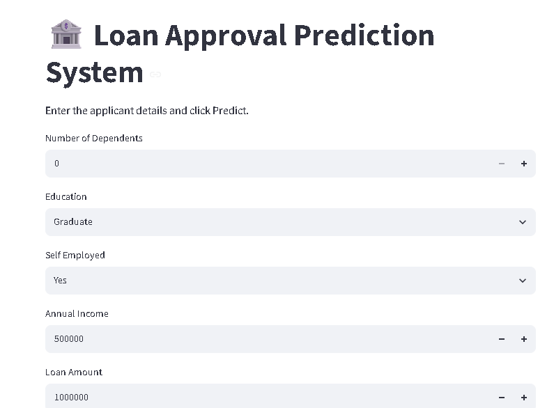

# 🏦 Loan Approval Prediction System

A machine learning web application that predicts whether a loan application is likely to be approved based on applicant and financial information.

🚀 **Live Demo:** [Try the Loan Prediction App](https://loan-prediction-app-apg4dln7fdto45kare37gg.streamlit.app/)

💻 **Source Code:** [GitHub Repository](https://github.com/ARAGALAGOVARDHANREDDY/loan-prediction-app)
## ✨ Features

- 🤖 Machine learning-based loan approval prediction
- 📝 Interactive applicant information form
- 📊 Uses financial and applicant-related features
- ⚡ Real-time prediction through Streamlit
- 🔄 Automated preprocessing and feature encoding
- 🌐 Deployed as a live web application
- 📱 Simple and user-friendly interface

# 🛠 Technologies Used

- Python
- Streamlit
- LightGBM
- Scikit-learn
- Pandas
- NumPy
- Joblib

---

## 📂 Project Structure

```text
loan-prediction-app/
│
├── app.py
├── loan_approval_model.pkl
├── scaler.pkl
├── education_encoder.pkl
├── employment_encoder.pkl
├── status_encoder.pkl
├── columns.json
├── loan_prediction_analysis.ipynb
├── requirements.txt
├── image/
│   ├── home.png
│   └── result.png
└── README.md

# 🚀 Installation

Clone the repository

```bash
git clone https://github.com/ARAGALAGOVARDHANREDDY/loan-prediction-app.git
```

Go inside the project folder

```bash
cd loan-prediction-app
```

Install the required libraries

```bash
pip install -r requirements.txt
```

Run the application

```bash
streamlit run app.py
```

---

# 📊 Input Features

The application uses the following information:

- Age
- Education
- Employment Status
- Annual Income
- Loan Amount
- Credit Score
- Loan Term

The trained model predicts whether the loan will be:

- ✅ Approved
- ❌ Rejected

---

## 📷 Application Screenshots

### 🏠 Home Page



### ✅ Prediction Result


# 📈 Machine Learning Workflow

1. Data Collection
2. Data Cleaning
3. Data Preprocessing
4. Feature Encoding
5. Feature Scaling
6. Model Training
7. Prediction
8. Streamlit Deployment

---

## 🔮 Future Improvements

- 📊 Add prediction probability
- 🔍 Add SHAP-based model explainability
- 🤖 Compare multiple machine learning models
- 🎨 Improve UI/UX
- 🗄️ Add database integration
- 📈 Add model performance dashboard
- 🔄 Implement model monitoring and retraining

# 👨‍💻 Author

**Aragala Govardhan Reddy**

GitHub:

https://github.com/ARAGALAGOVARDHANREDDY

---

⭐ If you like this project, please give it a Star.
