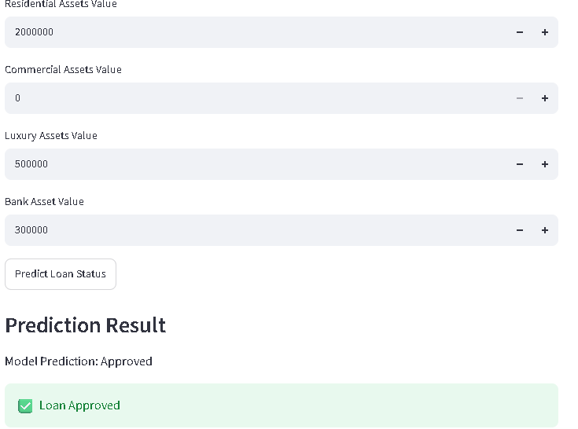

# 🏦 Loan Approval Prediction System

A Machine Learning web application that predicts whether a loan application will be Approved or Rejected based on applicant details.

The application is built using **Python**, **LightGBM**, and **Streamlit**.

---

# 📌 Features

- Predict Loan Approval
- Simple and Interactive User Interface
- Fast Predictions
- Machine Learning Model
- Data Preprocessing
- Easy to Use

---

# 🛠 Technologies Used

- Python
- Streamlit
- LightGBM
- Scikit-learn
- Pandas
- NumPy
- Joblib

---

# 📂 Project Structure

```
loan-approval-prediction/
│── app.py
│── loan_approval_model.pkl
│── scaler.pkl
│── education_encoder.pkl
│── employment_encoder.pkl
│── status_encoder.pkl
│── columns (1).json
```

---

# 🚀 Installation

Clone the repository

```bash
git clone https://github.com/ARAGALAGOVARDHANREDDY/loan-prediction-app.git
```

Go inside the project folder

```bash
cd loan-prediction-app
```

Install the required libraries

```bash
pip install -r requirements.txt
```

Run the application

```bash
streamlit run app.py
```

---

# 📊 Input Features

The application uses the following information:

- Age
- Education
- Employment Status
- Annual Income
- Loan Amount
- Credit Score
- Loan Term

The trained model predicts whether the loan will be:

- ✅ Approved
- ❌ Rejected

---

# 📷 Application Screenshots

## 🏠 Home Page


---

## ✅ Prediction Result


# 📈 Machine Learning Workflow

1. Data Collection
2. Data Cleaning
3. Data Preprocessing
4. Feature Encoding
5. Feature Scaling
6. Model Training
7. Prediction
8. Streamlit Deployment

---

# 🔮 Future Improvements

- Better UI Design
- SHAP Explainability
- Model Comparison
- Online Deployment
- Database Integration

---

# 👨‍💻 Author

**Aragala Govardhan Reddy**

GitHub:

https://github.com/ARAGALAGOVARDHANREDDY

---

⭐ If you like this project, please give it a Star.
